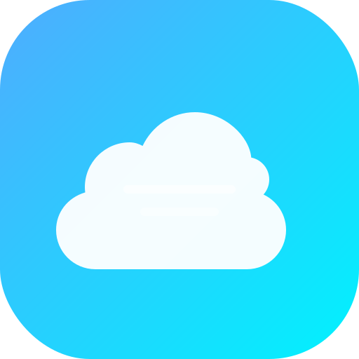

<p align="center">
  
</p>

<h1 align="center">Cloudreve Android</h1>

<p align="center">
  基于 <a href="https://github.com/cloudreve/Cloudreve">Cloudreve V4</a> API 的现代化安卓客户端，使用 Flutter 构建，支持 Material You 与 Apple 双主题风格。
</p>

<p align="center">
  
  
  
</p>

---

## 功能一览

### 文件管理

- **浏览文件**：支持多级目录浏览，面包屑导航快速跳转
- **文件夹操作**：新建文件夹、重命名、删除、移动、复制
- **文件下载**：获取临时下载链接，支持断点续传下载
- **文件上传**：支持分片上传，队列管理，进度显示
- **批量选择**：长按进入多选模式，支持批量删除
- **文件类型识别**：自动识别图片、视频、音频、文档等类型并显示对应图标

### 传输管理

- **下载管理器**：队列管理、断点续传、暂停/继续/取消
- **上传管理器**：队列管理、分片上传、进度实时显示
- **传输任务页**：上传/下载双 Tab 切换，统一管理所有传输任务

### 文件同步

- **多同步任务**：支持创建多个同步任务，每个任务独立配置
- **同步模式**：仅上传、仅下载、双向同步三种模式
- **定时同步**：可配置同步间隔（15分钟到每天）
- **文件过滤**：支持包含/排除通配符规则
- **同步进度**：实时显示当前文件、完成进度、同步状态

### 账户与存储

- **登录认证**：支持邮箱 + 密码登录，验证码支持
- **Token 刷新**：自动处理 AccessToken 过期刷新
- **存储空间**：实时显示已用/总存储容量
- **安全退出**：一键清除本地凭证并返回登录页
- **个人资料**：头像、昵称、用户组、存储详情展示

### 个性化

- **主题模式**：跟随系统 / 强制浅色 / 强制深色
- **界面风格**：Google 风（Material You，pill 按钮、圆角卡片）/ Apple 风（大标题、留白）
- **主题色**：18 色预设，支持自定义主题色
- **深色模式**：完整适配暗色主题

---

## 技术栈

| 项目 | 说明 |
|------|------|
| 框架 | Flutter (Dart SDK >= 3.0.0) |
| 状态管理 | Provider |
| 本地存储 | SharedPreferences（Token + 个性化配置） |
| 网络请求 | http |
| 日期格式化 | intl |
| 外部链接 | url_launcher |

---

## 项目结构

```
lib/
├── main.dart                          # 应用入口 + 主题配置 + 路由
├── models/
│   ├── file_item.dart                 # 文件/文件夹数据模型
│   └── user.dart                      # 用户与存储空间模型
├── screens/
│   ├── login_screen.dart              # 登录页（服务器地址 + 账号密码）
│   ├── file_manager_screen.dart       # 文件管理器（目录浏览 + 操作）
│   └── settings_screen.dart           # 设置（主题 + 风格 + 账户）
├── services/
│   └── api_service.dart               # Cloudreve V4 API 封装
└── utils/
    ├── storage.dart                   # SharedPreferences 封装
    └── theme.dart                     # 主题（Google/Apple 双风格 + 个性化）
```

---

## 快速开始

### 环境要求

- Flutter 3.x
- Dart SDK >= 3.0.0
- Android Studio 或 VS Code

### 构建运行

```bash
# 进入项目目录
cd Cloudreve-Android

# 安装依赖
flutter pub get

# 调试运行
flutter run

# 构建 Release APK
flutter build apk --release
```

### 使用

1. 首次启动输入 Cloudreve 服务器地址（Base URL）
2. 使用邮箱/用户名和密码登录
3. 进入文件管理器浏览、下载、管理文件
4. 在设置中切换主题、界面风格、主题色

---

## Cloudreve V4 API 参考

本项目调用 Cloudreve V4 RESTful API，所有路由以 `/api/v4/` 为前缀。

### 认证方式

- **JWT Required**：在请求头中携带 `Authorization: Bearer <AccessToken>`
- 登录接口 `POST /api/v4/session/signin` 返回 `access_token` 与 `refresh_token`
- Token 过期后使用 `POST /api/v4/session/token/refresh` 刷新

### 核心接口

| 功能 | 方法 | 端点 |
|------|------|------|
| 登录 | POST | `/api/v4/session/signin` |
| 刷新 Token | POST | `/api/v4/session/token/refresh` |
| 用户存储信息 | GET | `/api/v4/user/storage` |
| 列目录 | GET | `/api/v4/file/list` |
| 文件详情 | GET | `/api/v4/file/info` |
| 创建文件夹 | POST | `/api/v4/file/create` |
| 重命名 | POST | `/api/v4/file/rename` |
| 删除 | POST | `/api/v4/file/delete` |
| 移动 | POST | `/api/v4/file/move` |
| 复制 | POST | `/api/v4/file/copy` |
| 下载 | GET | `/api/v4/file/download` |
| 创建上传会话 | POST | `/api/v4/file/upload` |

### 响应格式

```json
{
  "data": ...,
  "code": 0,
  "msg": ""
}
```

- `code` 为 `0` 表示成功，非 `0` 表示失败
- 详细错误码定义请参考 [Cloudreve 官方文档](https://docs.cloudreve.org/en/api/overview#error-codes)

---

## 界面预览

### 登录页

- 简约居中布局，输入服务器地址、账号、密码
- 支持密码可见性切换

### 文件管理器

- 顶部面包屑导航栏，快速返回上级或跳转任意层级
- 文件列表按类型显示彩色图标
- 长按进入批量选择模式
- 右下角悬浮按钮新建文件夹

### 设置页

- 主题模式、界面风格、主题色切换
- 安全退出登录

---

## License

本项目仅供学习和参考使用。

---

Made with Flutter
